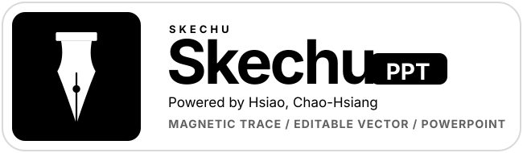
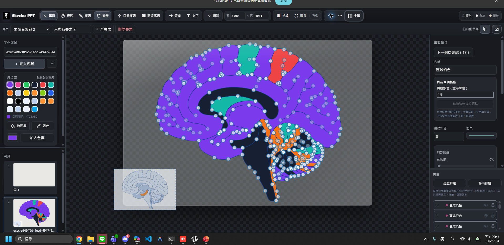
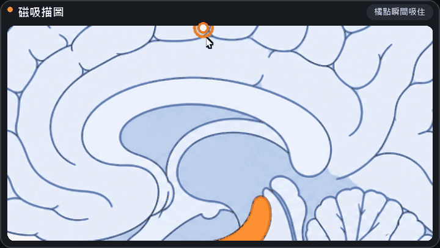
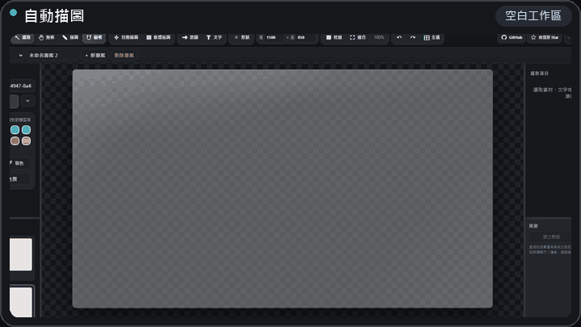
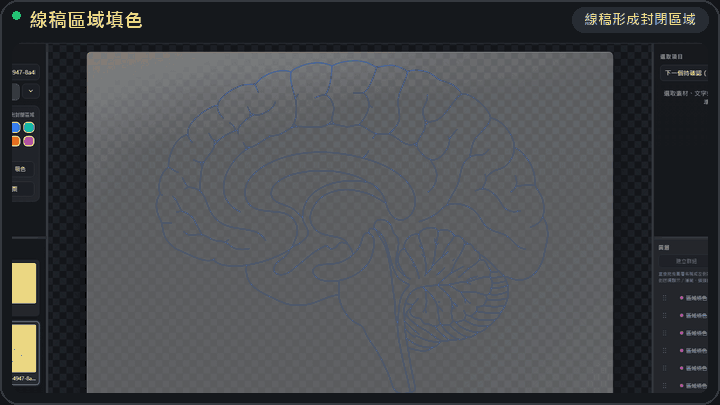
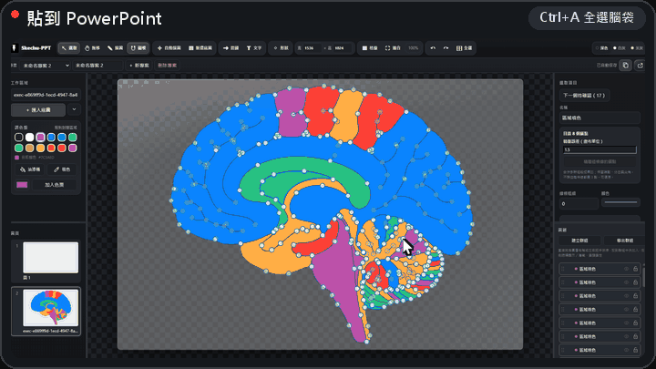

  

<strong>Trace an image into clean, editable vectors—without learning a complicated design tool.</strong>

  

<strong>Click Open Web and start drawing.</strong> 免安裝、免登入，打開網頁就能開始描圖。

Works on Windows, macOS, Linux, Chromebook, iPhone, iPad, and Android. Need native editable PowerPoint layers? <a href="https://github.com/evan6007/skechu-ppt/releases/latest/download/Skechu-PPT-Windows-Setup.exe">Get the Windows installer →</a>

  
  
  

  

A real Skechu-PPT project: hundreds of editable anchors, pages, layers, fills, and the original reference image in one workspace.

## See it at a glance

<table>
  <tr>
    <td width="50%"> <strong>Magnetic tracing</strong> — move near an image boundary and the orange point follows the real edge.</td>
    <td width="50%"> <strong>Auto trace</strong> — trace a complex reference, apply the result, and press Ctrl+A to reveal every anchor.</td>
  </tr>
  <tr>
    <td width="50%"> <strong>Connected-region fill</strong> — fill enclosed areas formed by your line art, including regions closed by T-junctions.</td>
    <td width="50%"> <strong>Native PowerPoint objects</strong> — copy any traced artwork into PowerPoint and edit every line, fill, and region independently.</td>
  </tr>
</table>

| ✦ **Auto trace** | 🧲 **Magnetic pen** | ◉ **Anchor editing** | 🪣 **Paint bucket** |
| :---: | :---: | :---: | :---: |
| Image → editable paths | Follow visible boundaries | Refine every curve | Fill closed regions |
| **▧ Pages** | **☷ Layers & groups** | **⌘ Clipboard import** | **P PowerPoint** |
| Reorder whole canvases | Organize complex artwork | Paste or drop images | Native editable shapes |

**One flow:** add a reference → trace automatically or by hand → refine anchors and colors → export SVG or paste editable objects into PowerPoint.

## Start in 30 seconds

| Use it now | You get |
| --- | --- |
| **[Open Web — recommended](https://evan6007.github.io/skechu-ppt/)** | The full editor on computer, phone, or tablet; no install or sign-in |
| **[Windows installer](https://github.com/evan6007/skechu-ppt/releases/latest/download/Skechu-PPT-Windows-Setup.exe)** | The editor plus native editable PowerPoint copy/paste |

1. Choose **新增底圖** and add any image.
2. Use **自動描圖** or place anchors with **描圖 / 磁吸**.
3. Export SVG, save a portable `.skc` project, or copy editable objects to PowerPoint.

Want the web edition to feel like a normal app? Follow the **[click-by-click install guide](docs/install.md)**—no command line required.

<strong>Detailed workflow, tracing controls, and clipboard behavior</strong>

- **Auto trace without guessing parameters:** leave **自動判斷** selected. Thin drawings use centerlines with shared T-junctions; solid black/white logos use closed outlines. The four live sliders control detail threshold, curve smoothness, anchor reduction, and tiny-fragment cleanup. The preview stays separate until you choose **套用線圖**.
- **Direct image import:** drag PNG, JPG, SVG, or a supported project file onto the page. You can also copy an image on the web and press Ctrl+V to create a new image layer while keeping its proportions.
- **Selection and anchors:** Ctrl+A selects immediately and shows editable anchors. Drag blank canvas space to marquee-select; drag an object to move it. Locked references are excluded.
- **Pages and layers:** drag the body of a page thumbnail or layer row to reorder it. Right-click pages for copy, paste, duplicate, rename, insertion, reordering, and deletion. Groups, visibility, locks, order, canvas size, and references survive `.skc` save/reload.
- **PowerPoint:** on Windows, install/start Skechu-PPT v0.1.2 or later, approve the local connection, copy in the editor, then press Ctrl+V in desktop PowerPoint. The bridge prepares changed geometry in the background and reuses cached objects when possible. See the [connection guide](docs/install.md#copy-from-open-web-directly-to-powerpoint).
- **Privacy:** reference images and autosaves remain on your device. Use **下載專案** when you want a portable backup.

<strong>If Skechu-PPT saves you from redrawing one figure, consider giving the project a ⭐.</strong>

## Which edition should I use?

| Feature | Web edition | Windows edition |
| --- | :---: | :---: |
| Manual and automatic tracing, anchor editing | ✓ | ✓ |
| Local autosave | ✓ | ✓ |
| Download and load `.skc` projects | ✓ | ✓ |
| Export editable SVG | ✓ | ✓ |
| Install as an app | ✓ | ✓ |
| Copy native editable layers to PowerPoint | ✓ with Windows companion | ✓ |

The native PowerPoint bridge uses Windows COM automation, so **Copy to PPT is Windows-only**, including when drawing in the web editor. It requires desktop PowerPoint and the running local companion. macOS, Linux, and mobile users still get the complete browser editor and SVG workflow.

## Your work stays yours

Skechu-PPT is local-first. The editor stores its autosave in the browser on your device; it does not upload reference images or projects to a Skechu server. Use **Download project** whenever you want a portable backup or need to continue on another device.

## Project status

Skechu-PPT is an open-source public preview. Detailed keyboard controls are in the [user guide](docs/guide.md); implementation details are in the [architecture notes](docs/architecture.md); current work is tracked in the [roadmap](ROADMAP.md) and [changelog](CHANGELOG.md).

<strong>Developers and contributors</strong>

The hosted editor is a static, dependency-vendored web app. The optional Windows bridge is Python plus `pywin32`. Source-based setup, tests, and architecture notes are intentionally kept out of the beginner quick start.

Bug reports, small documentation improvements, and focused pull requests are welcome. Please read [CONTRIBUTING.md](CONTRIBUTING.md) and [SECURITY.md](SECURITY.md) first.

## License

Skechu-PPT is released under the [MIT License](LICENSE). KaTeX is distributed under its own MIT license; see [THIRD_PARTY_NOTICES.md](THIRD_PARTY_NOTICES.md).
