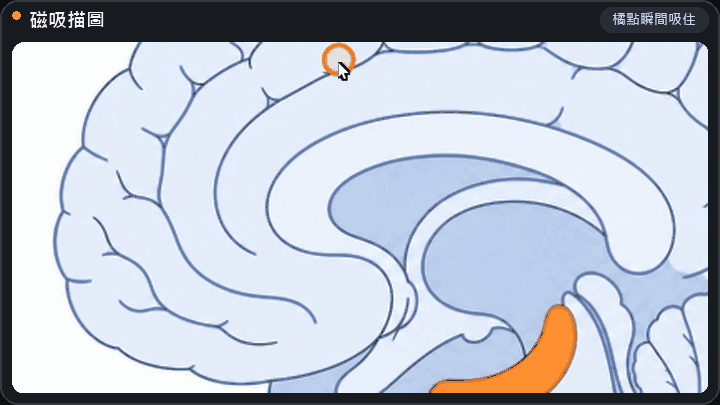
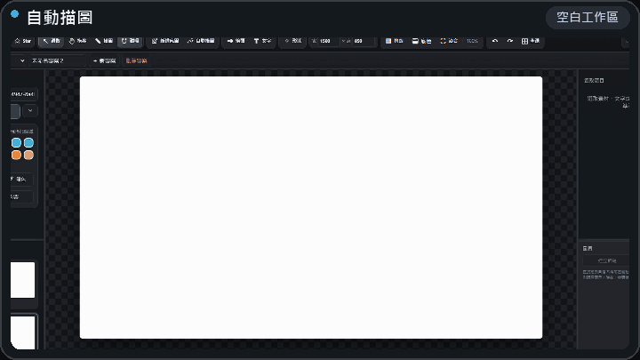
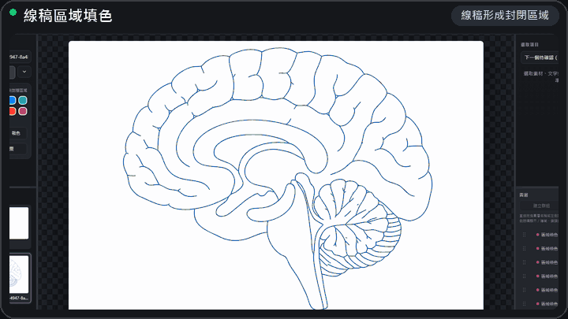
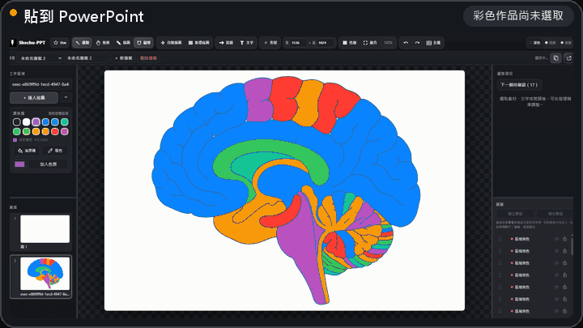

  

<strong>Trace images. Refine every curve. Keep editing in PowerPoint.</strong> A free, open-source editor for turning flat images into editable artwork.

  

免安裝、免登入。匯入圖片，描線、填色，再把每個物件繼續改。

Works on Windows, macOS, Linux, Chromebook, iPhone, iPad, and Android. Need native editable PowerPoint layers? <a href="https://github.com/evan6007/skechu-ppt/releases/latest/download/Skechu-PPT-Windows-Setup.exe">Get the Windows installer →</a>

  
  
  

  

A real Skechu-PPT project: hundreds of editable anchors, pages, layers, fills, and the original reference image in one workspace.

## See it at a glance

<table width="100%">
  <tr>
    <td width="50%" valign="top"></td>
    <td width="50%" valign="top"></td>
  </tr>
  <tr>
    <td valign="top"><strong>Magnetic tracing</strong> Move near an image boundary. The orange point follows the edge.</td>
    <td valign="top"><strong>Auto trace</strong> Turn a reference into line art. Every anchor stays editable.</td>
  </tr>
  <tr>
    <td width="50%" valign="top"></td>
    <td width="50%" valign="top"></td>
  </tr>
  <tr>
    <td valign="top"><strong>Connected-region fill</strong> Fill areas enclosed by your line art—even at T-junctions.</td>
    <td valign="top"><strong>Native PowerPoint objects</strong> Edit lines, fills, and regions independently in desktop PowerPoint.</td>
  </tr>
</table>

## More than tracing

- **Curves you can refine:** edit anchors, tangents, shared junctions, and local smoothing.
- **A workspace that stays organized:** pages, layers, groups, locks, and adjustable canvas size and color.
- **Touch controls:** two-finger pan and zoom, compact panels, separate copy/paste, and a visible delete button.
- **Portable work:** save `.skc` projects, export SVG, or copy native objects to PowerPoint with the Windows companion.
- **Programmatic editing:** an opt-in command API and local MCP connector for supported AI clients. Batch edits share the editor's undo history.

**One flow:** add a reference → trace → refine → export. Use the illustration above as an example, not a restriction on what you can draw.

## Let your tools work with you

Read objects, select them, change colors in a batch, move independent shapes, or start a background tracing job from code or a connected AI client.

Open **專案與匯出 → 程式／AI 工具** to enable access to the current page. Access is off by default, ends when you switch pages or reload, and deletion asks for confirmation. Tracing results stay separate until applied.

The **browser command API** works in the web editor. The **optional MCP connector** runs locally and opens its own editor workspace; it does not silently attach to a GitHub Pages tab. No AI subscription is needed for normal drawing.

[Command API & MCP setup →](docs/automation.md)

## Start in 30 seconds

| Use it now | You get |
| --- | --- |
| **[Open Web — recommended](https://evan6007.github.io/skechu-ppt/)** | The full editor on computer, phone, or tablet; no install or sign-in |
| **[Windows installer](https://github.com/evan6007/skechu-ppt/releases/latest/download/Skechu-PPT-Windows-Setup.exe)** | The editor plus native editable PowerPoint copy/paste |

1. Choose **新增底圖** and add any image.
2. Use **自動描圖** or place anchors with **描圖 / 磁吸**.
3. Export SVG, save a portable `.skc` project, or copy editable objects to PowerPoint.

Want the web edition to feel like a normal app? Follow the **[click-by-click install guide](docs/install.md)**—no command line required.

<strong>Detailed workflow, tracing controls, and clipboard behavior</strong>

- **Auto trace without guessing parameters:** leave **自動判斷** selected. Thin drawings use centerlines with shared T-junctions; solid black/white logos use closed outlines. The four live sliders control detail threshold, curve smoothness, anchor reduction, and tiny-fragment cleanup. The preview stays separate until you choose **套用線圖**.
- **Direct image import:** drag PNG, JPG, SVG, or a supported project file onto the page. You can also copy an image on the web and press Ctrl+V to create a new image layer while keeping its proportions.
- **Selection and anchors:** Ctrl+A selects immediately and shows editable anchors. Drag blank canvas space to marquee-select; drag an object to move it. Locked references are excluded.
- **Pages and layers:** drag to reorder on desktop; use the drag handles on touch devices. Right-click a page for its actions, or open its settings on mobile. Groups, visibility, locks, order, canvas size, and references survive `.skc` save/reload.
- **PowerPoint:** on Windows, install/start Skechu-PPT v0.1.2 or later, approve the local connection, copy in the editor, then press Ctrl+V in desktop PowerPoint. The bridge prepares changed geometry in the background and reuses cached objects when possible. See the [connection guide](docs/install.md#copy-from-open-web-directly-to-powerpoint).
- **Privacy:** reference images and autosaves remain on your device. Use **下載專案** when you want a portable backup.

<strong>If Skechu-PPT saves you from redrawing one figure, consider giving the project a ⭐.</strong>

## Which edition should I use?

| Feature | Web edition | Windows edition |
| --- | :---: | :---: |
| Manual and automatic tracing, anchor editing | ✓ | ✓ |
| Local autosave | ✓ | ✓ |
| Download and load `.skc` projects | ✓ | ✓ |
| Export editable SVG | ✓ | ✓ |
| Install as an app | ✓ | ✓ |
| Copy native editable layers to PowerPoint | ✓ with Windows companion | ✓ |

The native PowerPoint bridge uses Windows COM automation, so **Copy to PPT is Windows-only**, including when drawing in the web editor. It requires desktop PowerPoint and the running local companion. macOS, Linux, and mobile users still get the complete browser editor and SVG workflow.

## Your work stays yours

Skechu-PPT is local-first. Normal drawing and autosave stay in your browser; reference images and projects are not uploaded to a Skechu server. Use **Download project** for a portable backup or to continue on another device.

If you explicitly enable automation, requested object data and exports can be returned to your connected AI client. That client's data-handling policy applies. Read-only object listings omit image pixels; the MCP connector has no arbitrary filesystem, system clipboard, PowerPoint, or GitHub account tools.

## Project status

Skechu-PPT is an open-source public preview. Detailed keyboard controls are in the [user guide](docs/guide.md); implementation details are in the [architecture notes](docs/architecture.md); current work is tracked in the [roadmap](ROADMAP.md) and [changelog](CHANGELOG.md).

<strong>Developers and contributors</strong>

The hosted editor is a static, dependency-vendored web app. The optional Windows bridge is Python plus `pywin32`; the optional MCP connector uses the official Python MCP SDK. Neither is required for ordinary web editing.

Start with the [documentation index](docs/README.md), [automation guide](docs/automation.md), or [repository map](docs/architecture.md#repository-map).

Bug reports, small documentation improvements, and focused pull requests are welcome. Please read [CONTRIBUTING.md](CONTRIBUTING.md) and [SECURITY.md](SECURITY.md) first.

## License

Skechu-PPT is released under the [MIT License](LICENSE). KaTeX is distributed under its own MIT license; see [THIRD_PARTY_NOTICES.md](THIRD_PARTY_NOTICES.md).
